Before I started this I have downloaded VMware-vRealize-Automation-SaltStack-Config-8.10.1.0-20668427_OVF10.ova and placed a copy in /tmp on my vRSLCM node. If vRSLCM have internet access you can download it directly from within vRSLCM.

Locker.

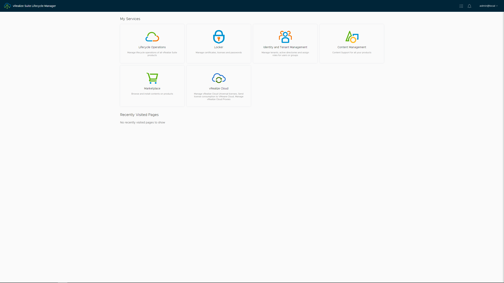

Certificates - GENERATE.

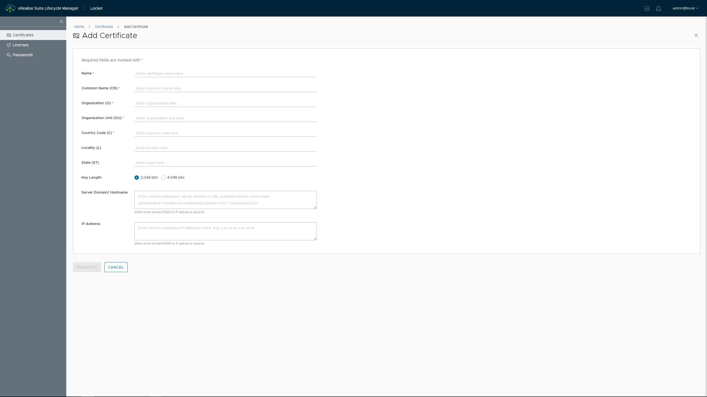

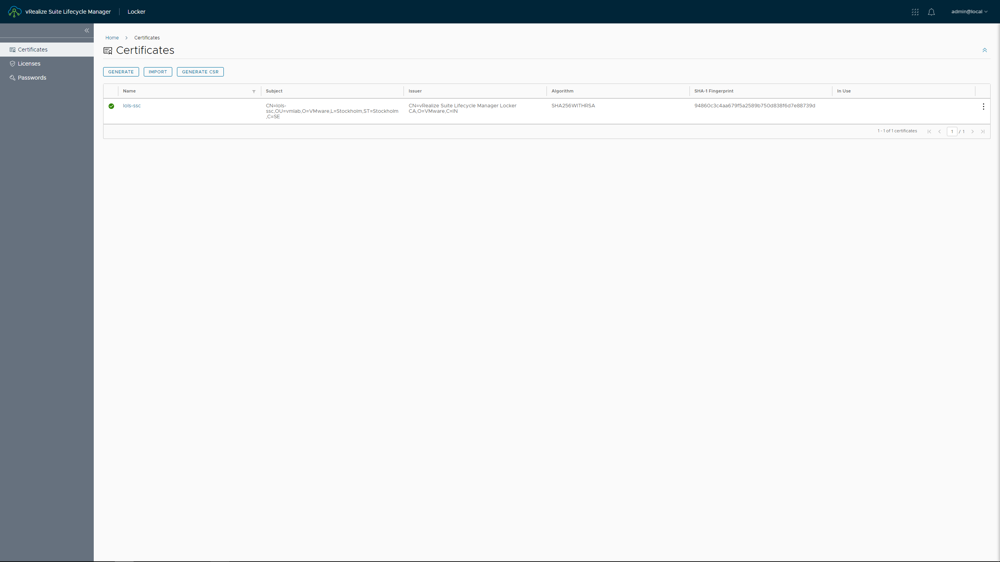

Go to Lifecycle Operations.

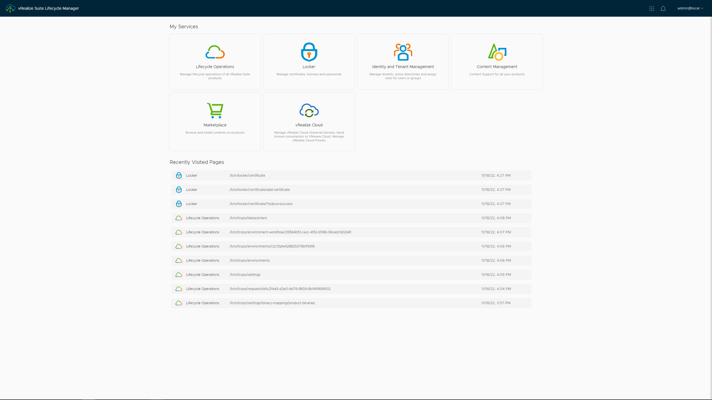

Settings - Binary Mapping.

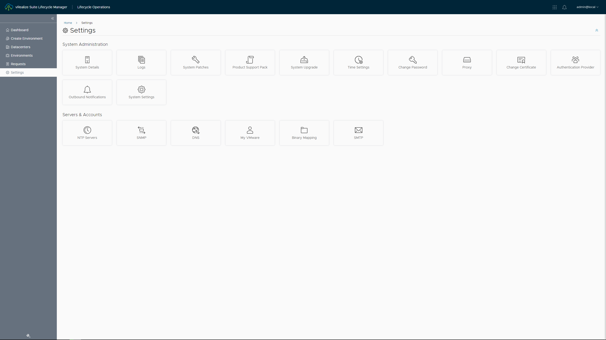

Click ADD BINARIES. Change Base Location to /tmp. Click DISCOVER. Select the SaltStack Config ova and click ADD.

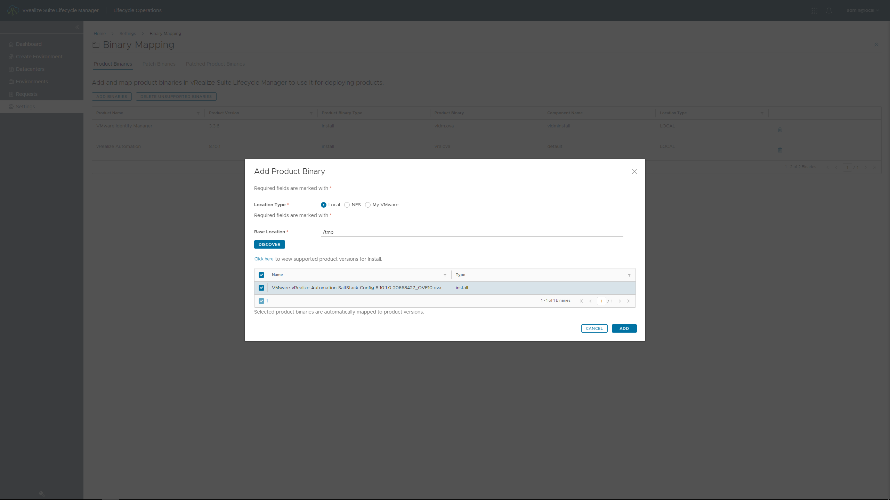

Got to Environments. Click the three dots and choose Add Product.

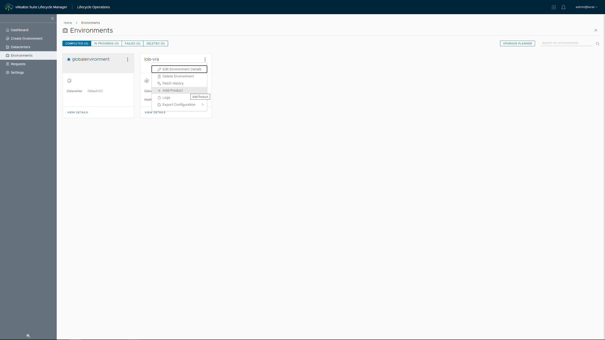

VreAlize Automation SaltStack Config. New Install. Version. vRA-Integrated. Deployment Type: Standard. Click Next.

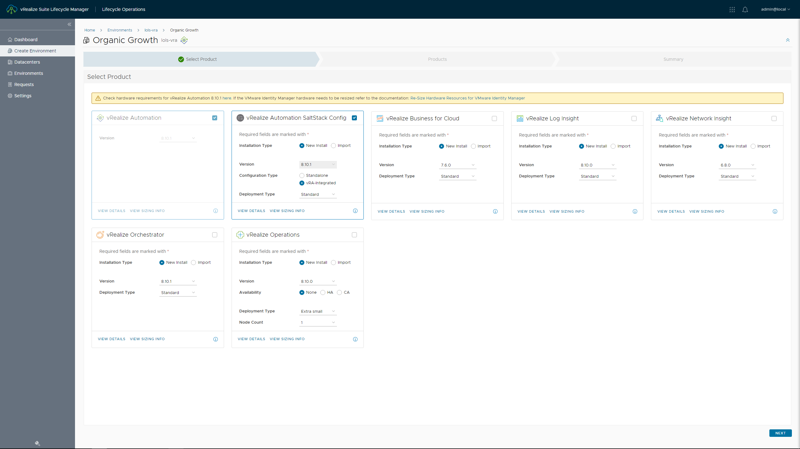

Add, Select and Validate your license. 

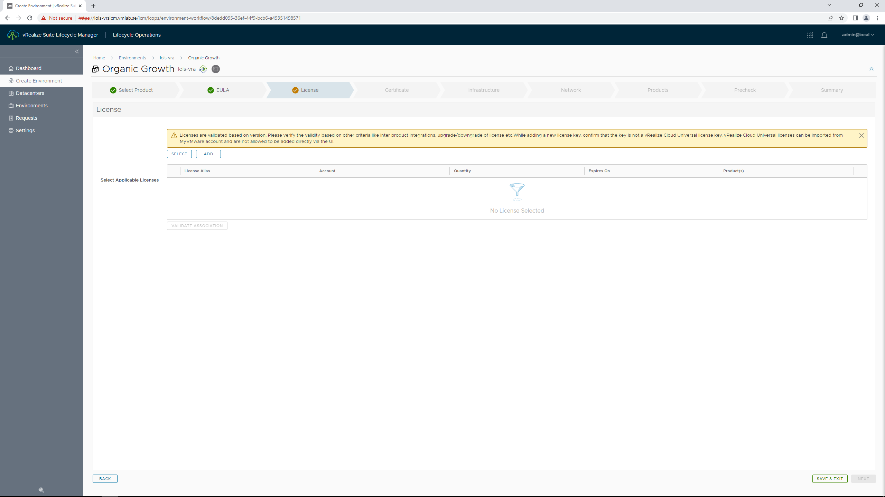

Select the Certificate you created earlier.

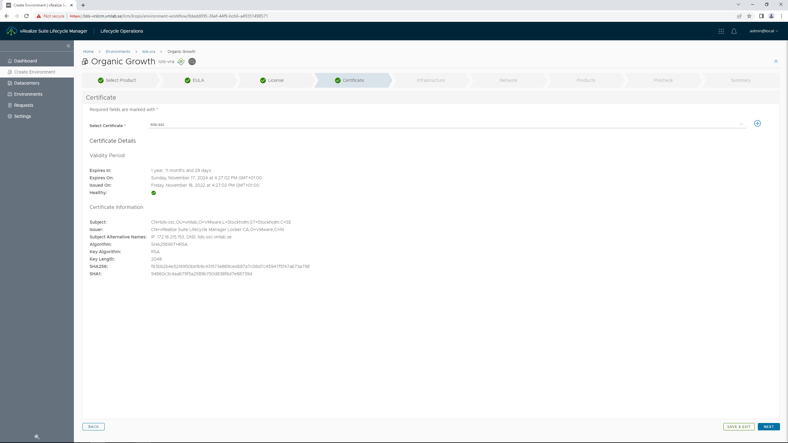

Select Cluster, Folder, Resource Pool, Network, Datastore. Enable Integrate with Identity Manager.

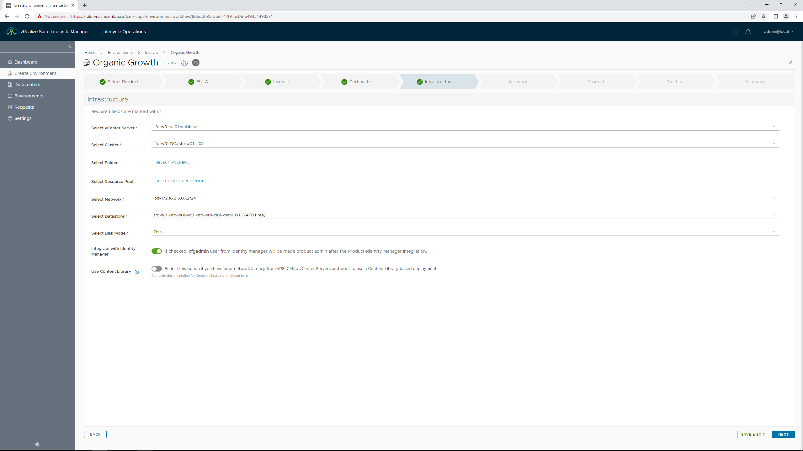

Network settings.

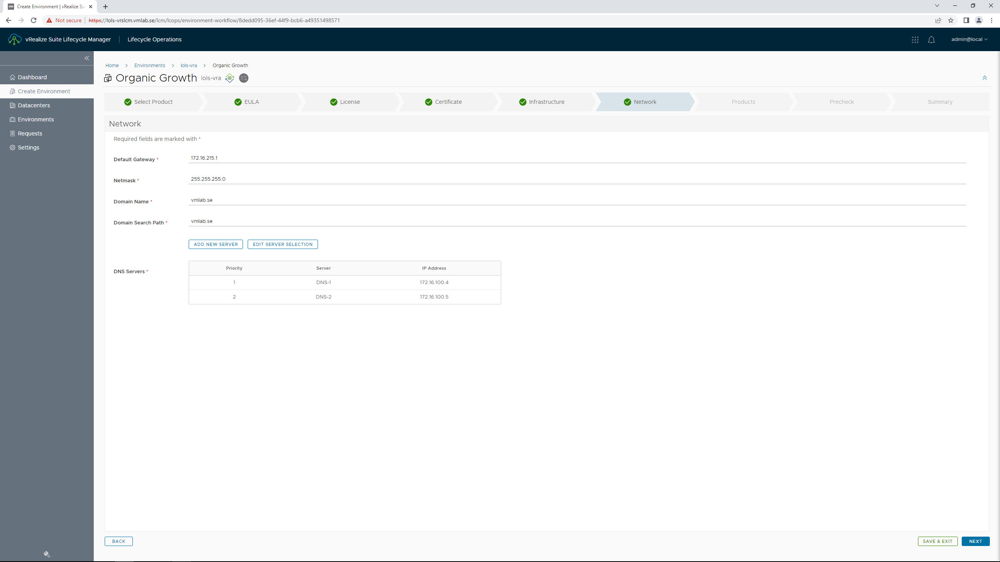

Check Integrate with Identity Manager.

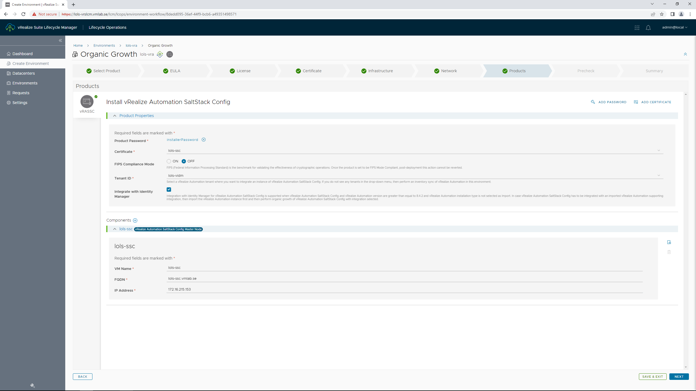

Run Pre Check and verify everything is OK.

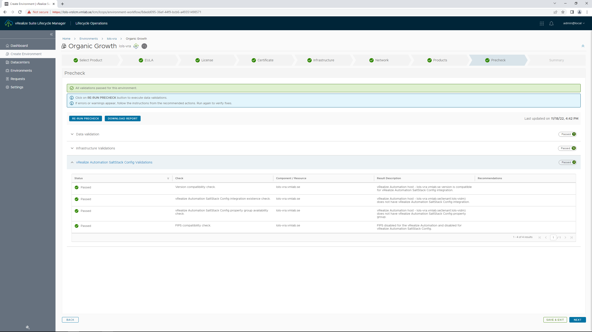

Submit.

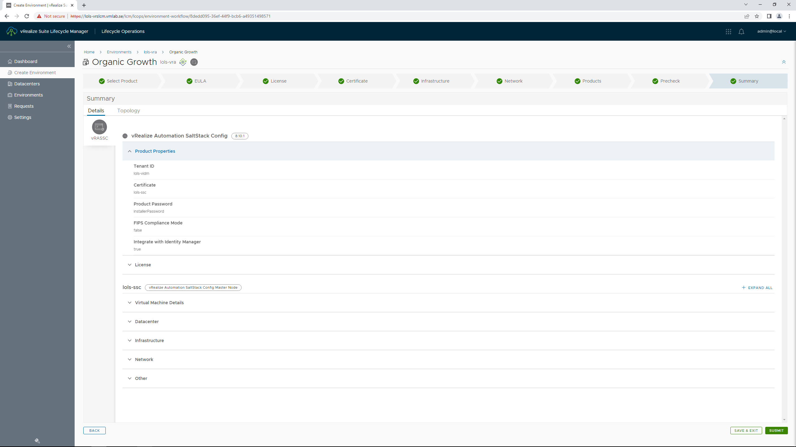

Wait for installation to complete.

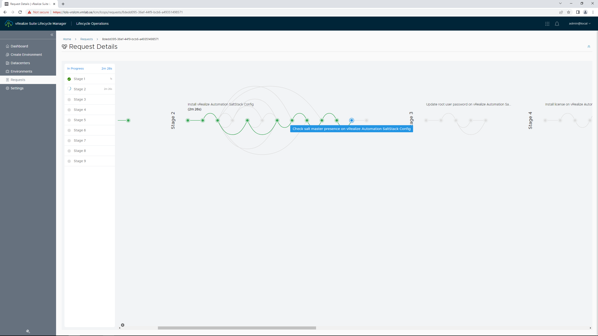

