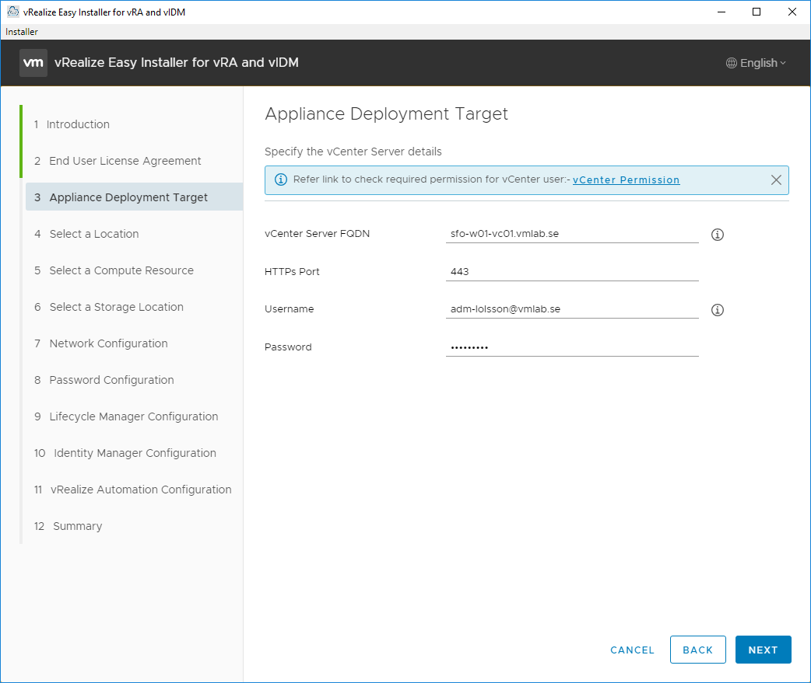
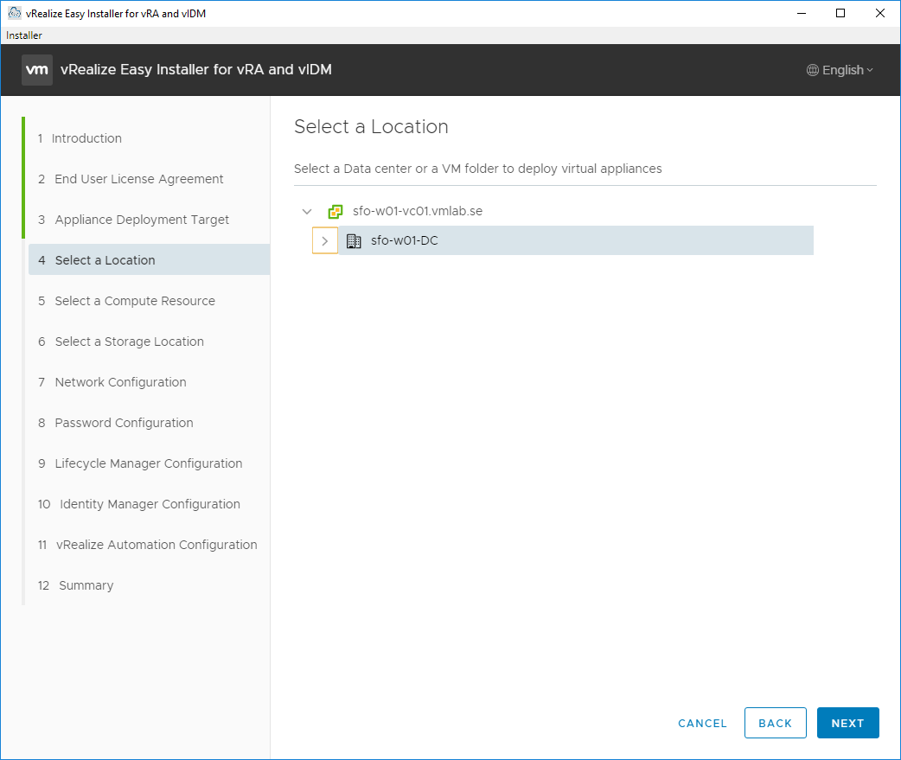
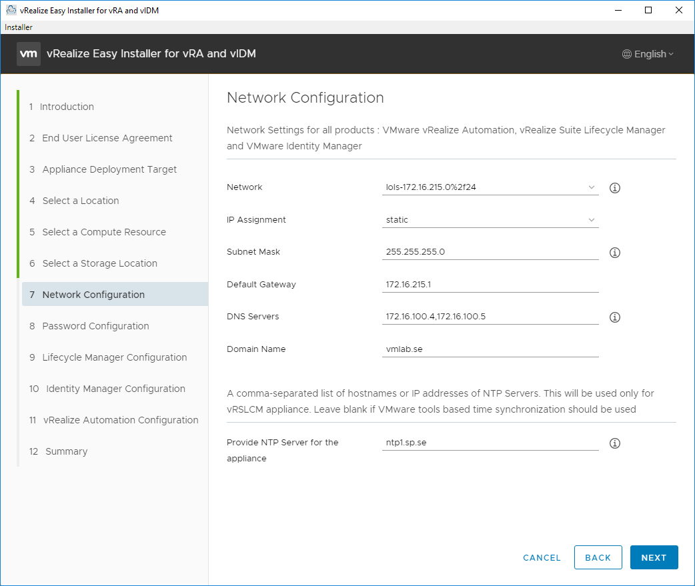
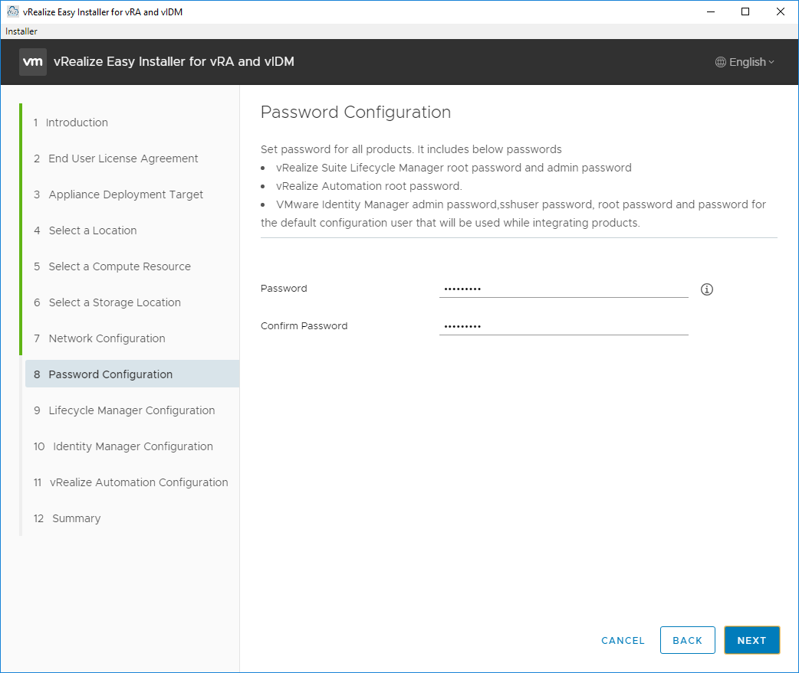
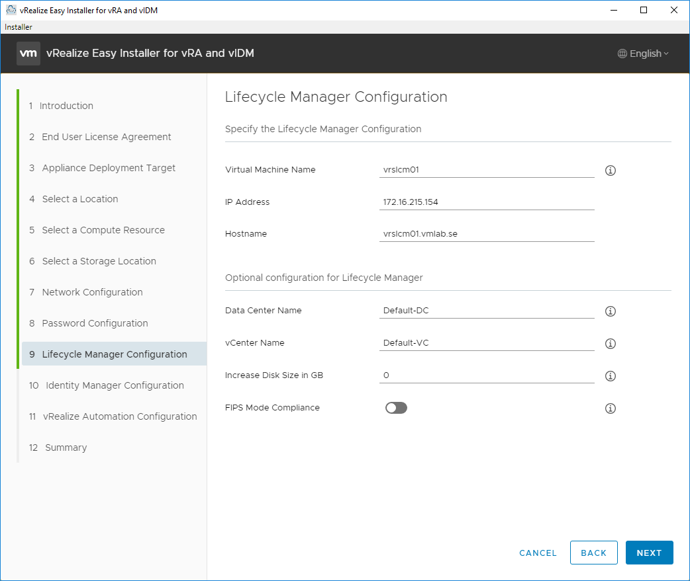
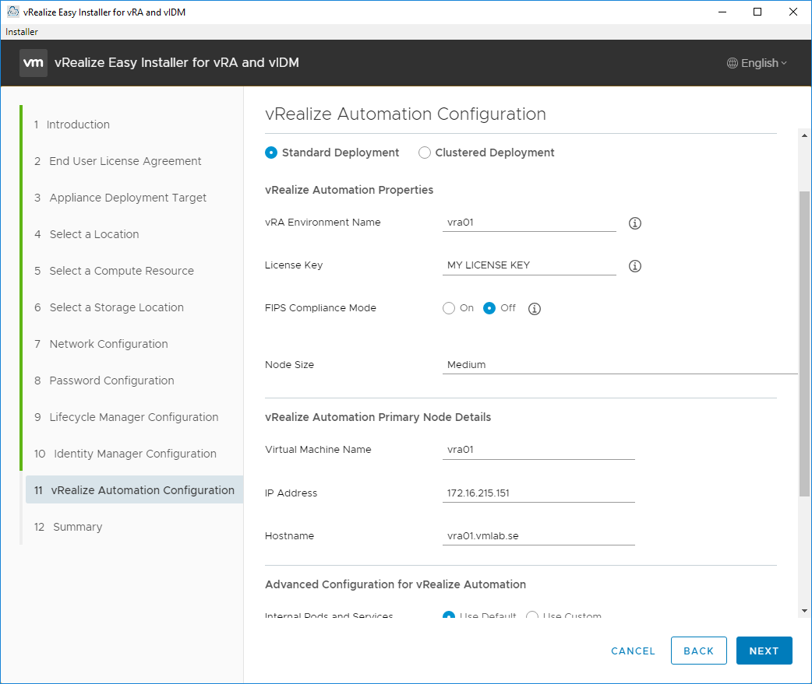

Download and mount VMware vRealize Suite Lifecycle Manager Easy Installer for vRA. This ISO package contains vRealize Automation, VMware Identity Manager and vRealize Suite Lifecycle Manager. 

The vRealize Easy Installer helps you install vRealize Automation and VMware Identity Manager in less time than it would take to install individual products. 

EULA and CEIP.

Specify the vCenter Server details.

If your SSL certificate is untrusted you will get a warning.

Select a Location for the virtual appliances.

Select a compute resource to deploy the virtual appliances.

Select a Storage Location.

Network Configuration.

Password Configuration (initial setup account will be created in step 10.)

Lifecycle Manager Configuration.

Identity Manager Configuration. The Default Configuration Admin you create in this step will later be used to do the initial configuration of vRA and vIDM.

Aria Automation Configuration. I'm choosing a Standard one node deployment to keep it simple in my lab.

Make sure all your values are correct and hit SUBMIT.

