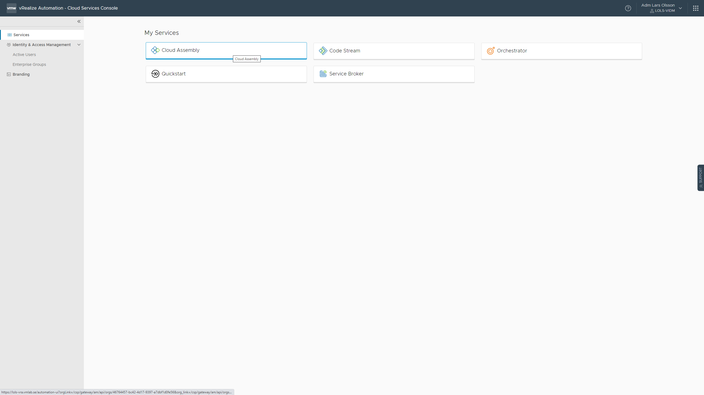

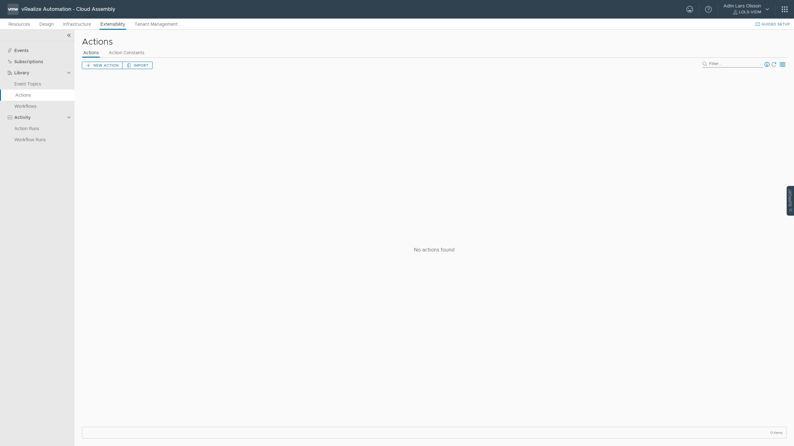

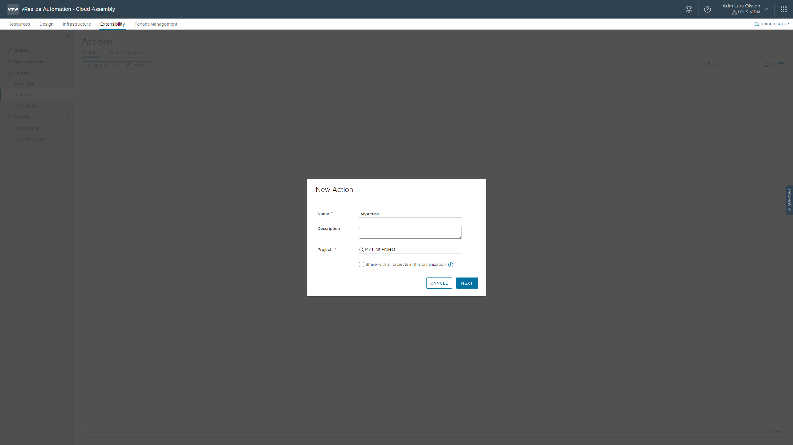

```
def handler(context, inputs):
    greeting = "Hello, {0}!".format(inputs["target"])
    print(greeting)

    outputs = {
      "greeting": greeting
    }

    return outputs
```

Hit Save and then Create Version

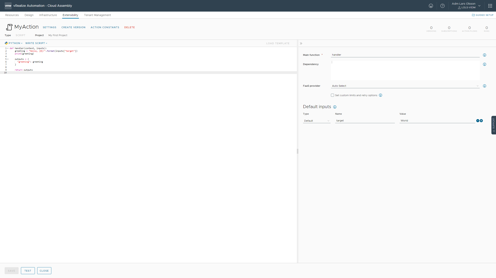

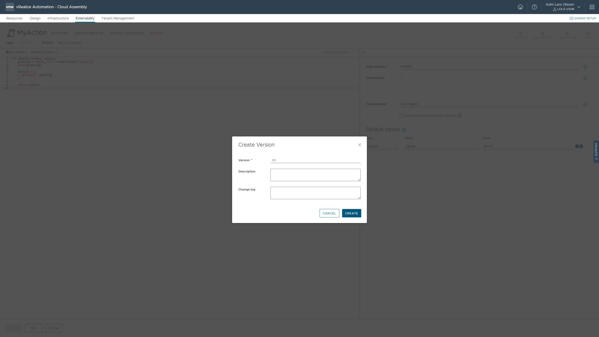

Click versions in upper right corner


Click RELEASE

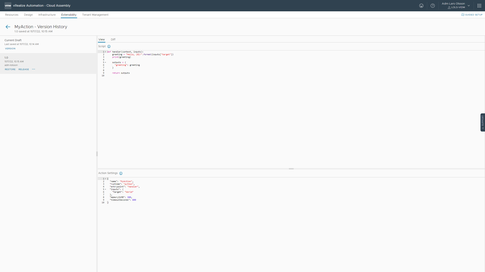

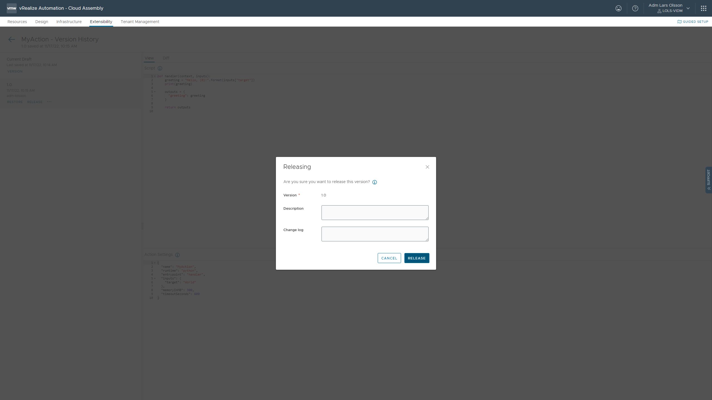

Go to Service Broker to update your content sources

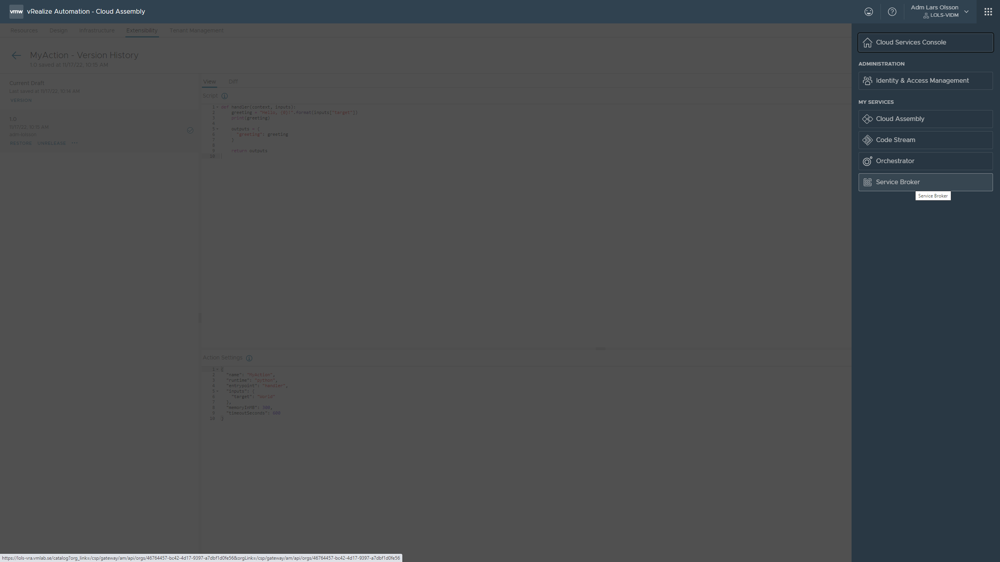

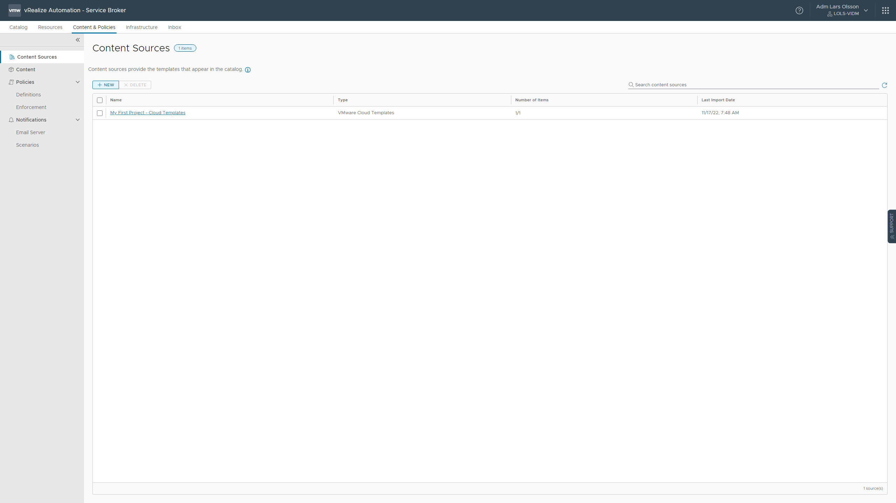

Extensibility actions


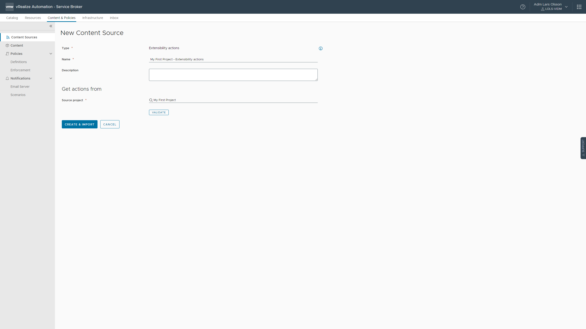

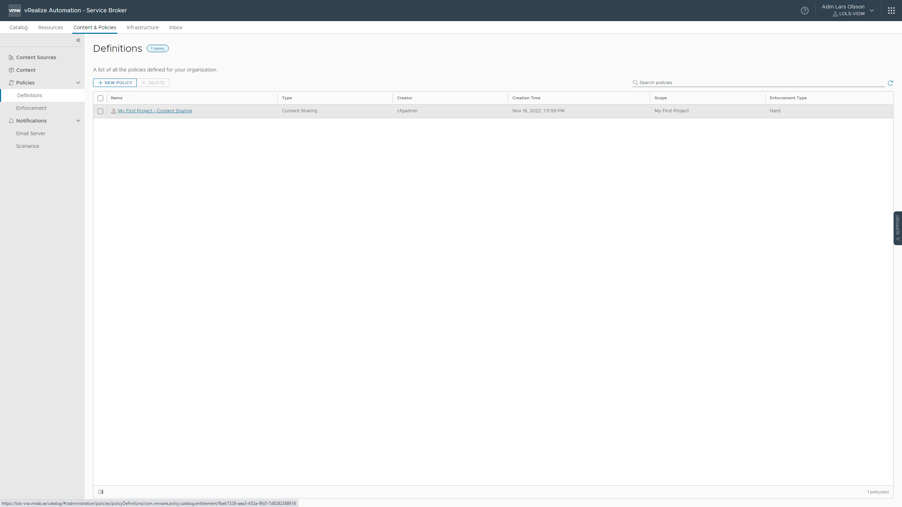

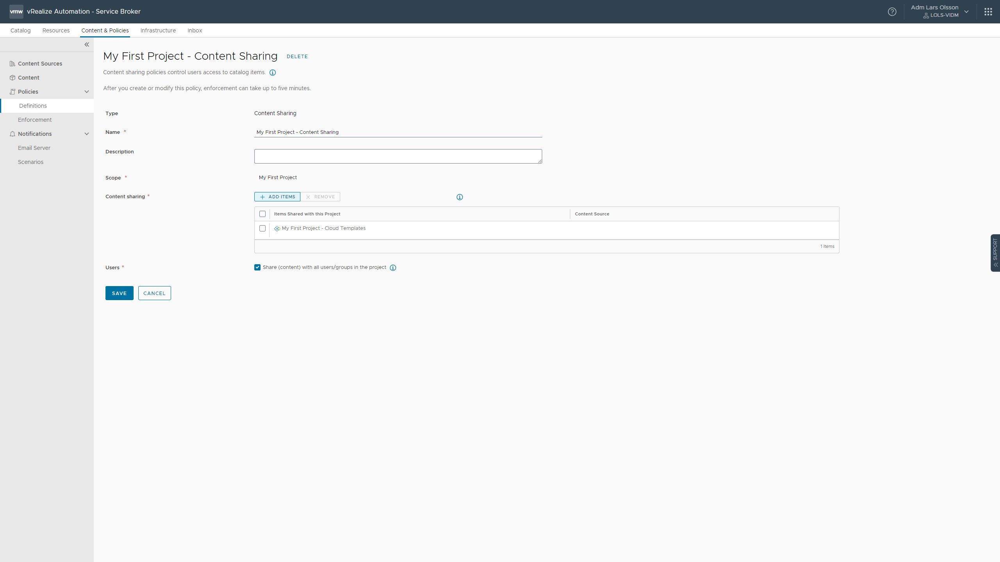

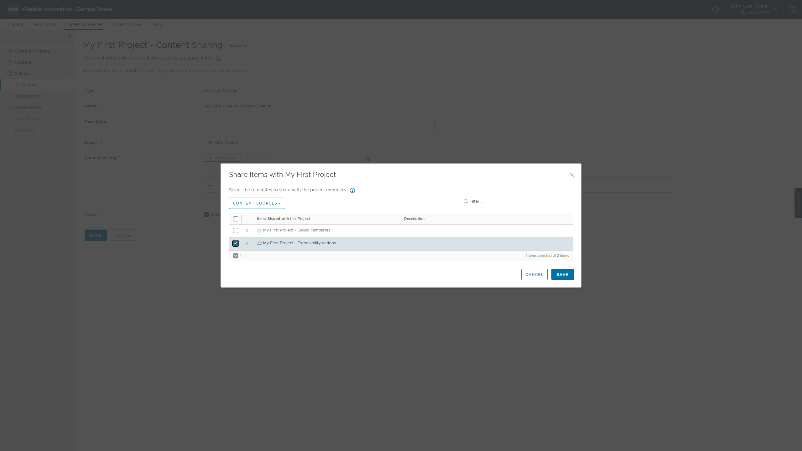

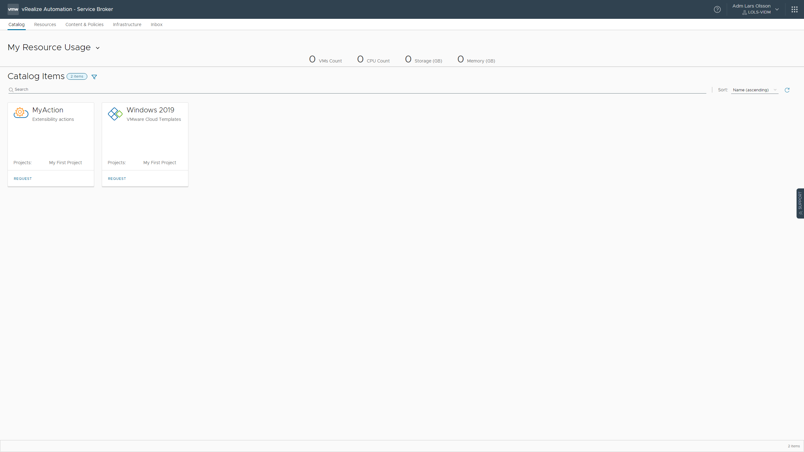

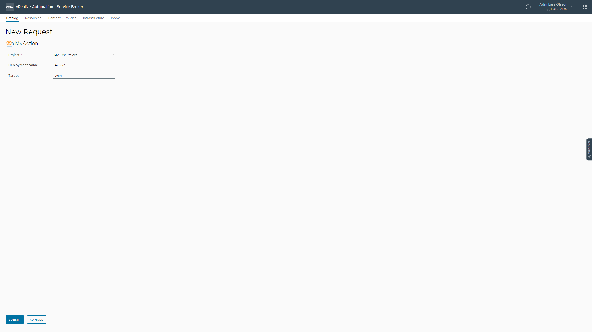

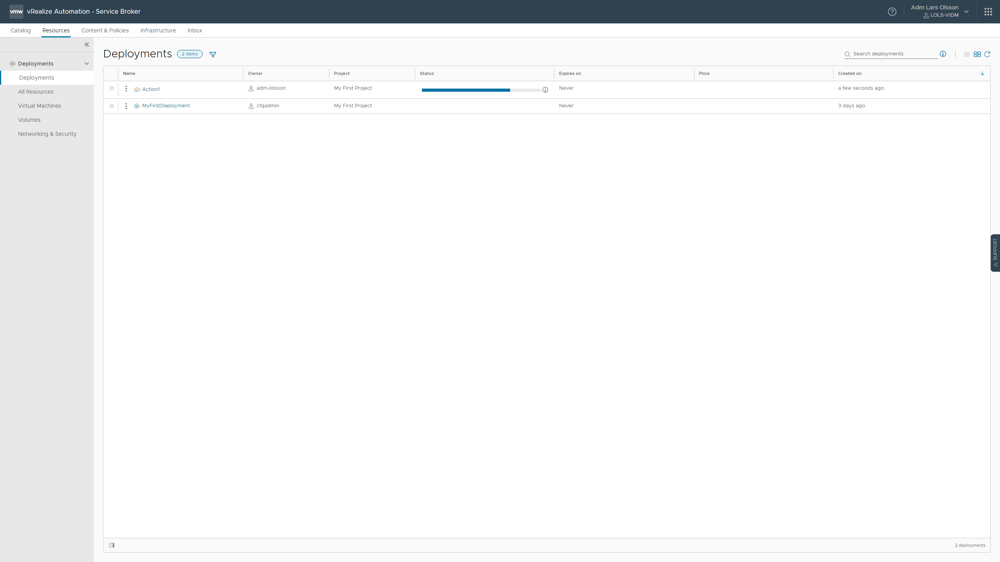

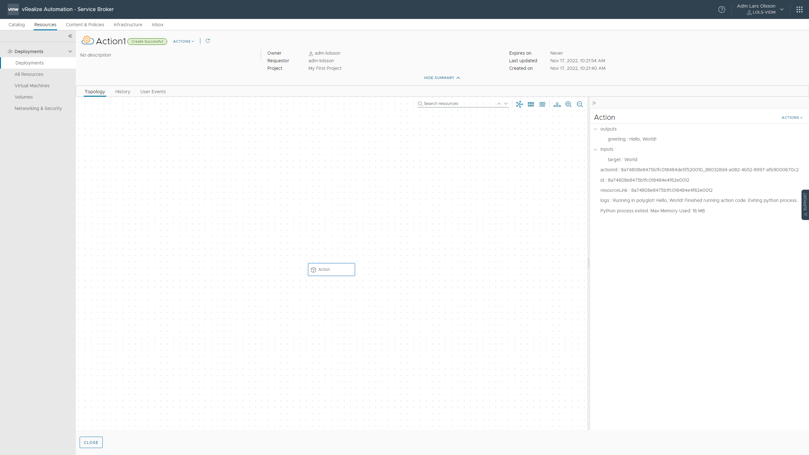

