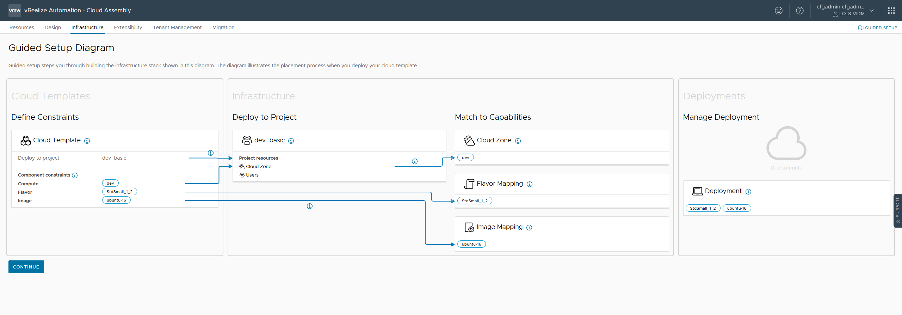
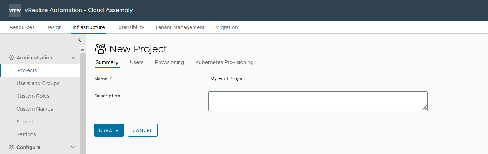
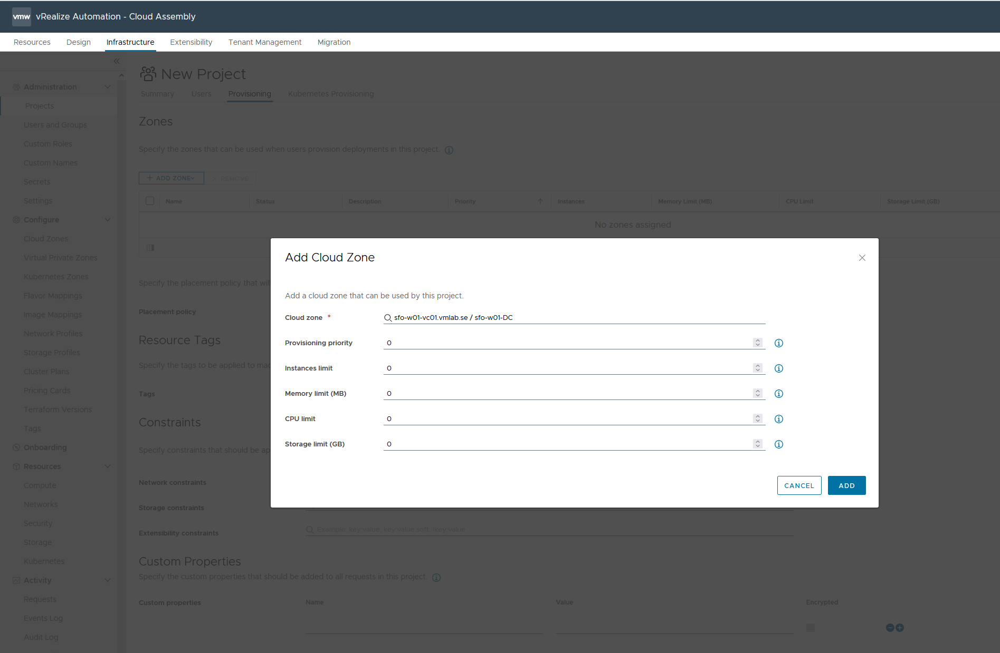
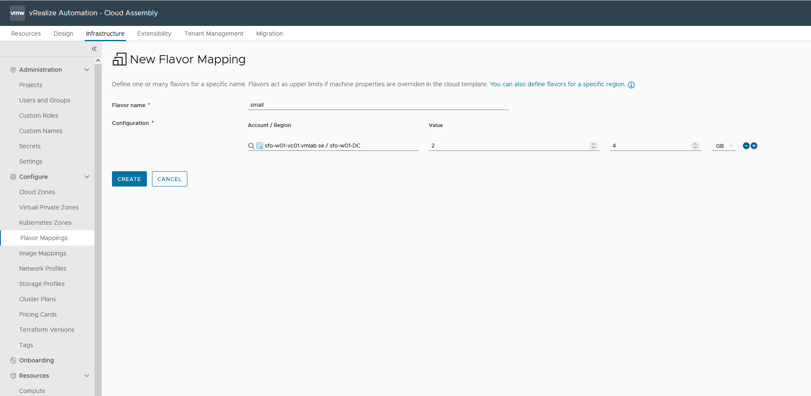
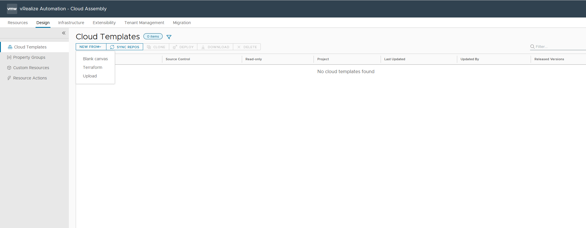
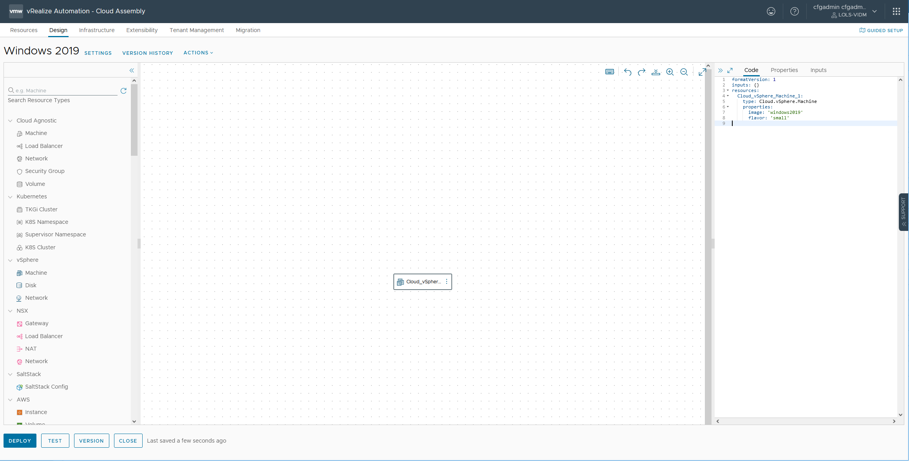
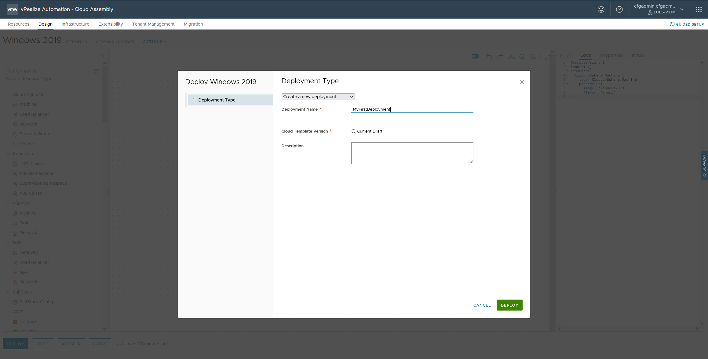

Login to vRA - https://<vra-ip/fqdn> using the username you enteredin [step 10](./deployment.md).

Click Infrastructure tab.

Click Continue and then scroll down in the menu to your left and click Cloud Accounts. Choose vCenter Server.

Click New Cloud Account and enter a name, vCenter FQDN and the username and password to be used for connecting to your vCenter Server. Click Validate. If Validate is successful continue and mark "Allow provisioning to these datacenters." Click ADD.

Time to create a [project](https://learncloudassembly.github.io/Infrastructure/Administration/Projects/). Go to Infrastructure - Project. Click New Project. Give your project a name and click CREATE.

Go to the tab Users and click ADD USERS. 

Search for the user you created during step 10 in the [initial deployment](./deployment.md).

Add a [Cloud Zone](https://learncloudassembly.github.io/Infrastructure/Configure/Cloud-Zones/) to your project.

Scroll down and enter MFP-${###} in the Custom Nameing field. More details on custom names: https://blogs.vmware.com/management/2022/04/custom-naming-reimagined.html

Configure [Flavor Mappings](https://learncloudassembly.github.io/Infrastructure/Configure/Flavor-Mappings/) in Infrastructure - Flavor Mappings.

And [Image Mappings](https://learncloudassembly.github.io/Infrastructure/Configure/Image-Mappings/) in Infrastructure Image Mappings.

Time to create you first Cloud Template. Create it from Blank Canvas or upload my [example](https://github.com/larols/vmware-aria/blob/main/aria-automation/Windows%202019.yaml) My example needs a flavor called 'small' and an image named 'windows2019'.

[Code example](https://github.com/larols/vmware-aria/blob/main/aria-automation/Windows%202019.yaml)

You can now go ahead and hit Deploy and give your Deployment a name.

Track your deployment in Resources - Deployments.

