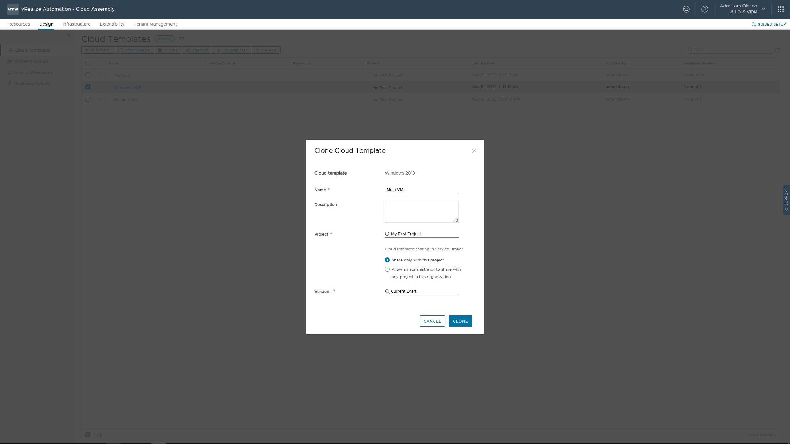
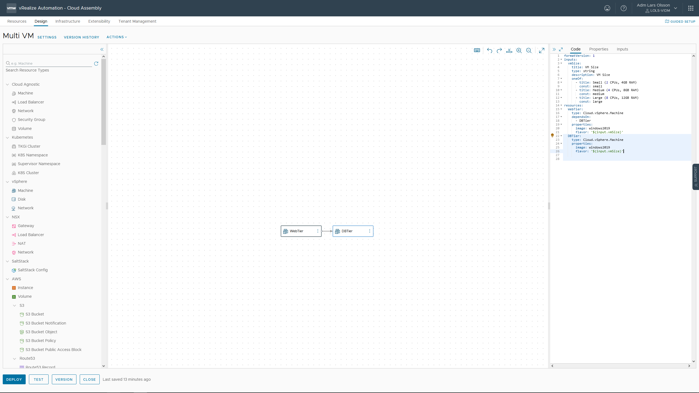
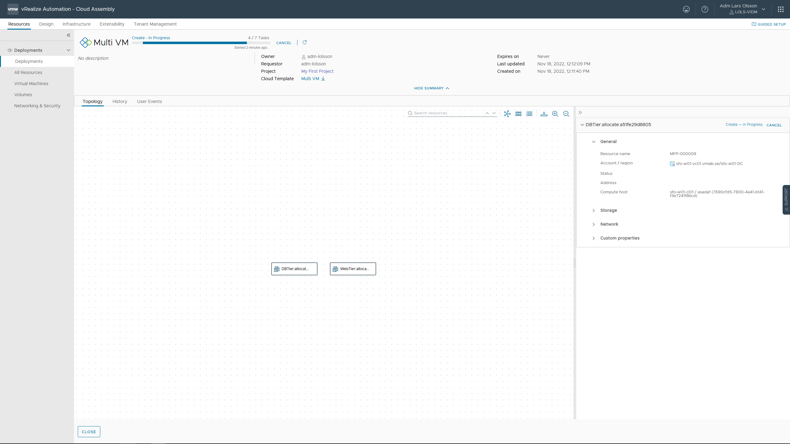

Start off by cloning your Windows 2019 Cloud Template.



Drag and drop another vSphere Virtual Machine out on the canvas.


Your YAML code will then look like this. We will make a few changes to it.

```
formatVersion: 1
inputs: {}
resources:
  Cloud_vSphere_Machine_1:
    type: Cloud.vSphere.Machine
    properties:
      image: windows2019
      flavor: small
  Cloud_vSphere_Machine_2:
    type: Cloud.vSphere.Machine
    properties:
      image: ''
      cpuCount: 1
      totalMemoryMB: 1024
```

First off we are adding inputs for the consumer to be able to select the size of the VMs. We are using flavor mappings in this example.

```
inputs:
  vmSize:
    title: VM Size
    type: string
    description: VM Size
    oneOf:
      - title: Small (2 CPUs, 4GB RAM)
        const: small
      - title: Medium (4 CPUs, 8GB RAM)
        const: medium
      - title: Large (8 CPUs, 12GB RAM)
        const: large
```

Secondly we are renaming the different vSphere machine objects to something more explanatory. 

```
resources:
  Cloud_vSphere_Machine_1:
resources:
  Cloud_vSphere_Machine_2:


resources:
  WebTier:
resources:
  DBTier:
```

Thirdly we make sure the DBTier is provisioned before WebTier by adding:

```
dependsOn:
  - DBTier
```

And finally we make sure the size input is used by the vSphere VMs by changing

```
flavor: small

flavor: '${input.vmSize}'
```

Your final code should look like this.

```
formatVersion: 1
inputs:
  vmSize:
    title: VM Size
    type: string
    description: VM Size
    oneOf:
      - title: Small (2 CPUs, 4GB RAM)
        const: small
      - title: Medium (4 CPUs, 8GB RAM)
        const: medium
      - title: Large (8 CPUs, 12GB RAM)
        const: large
resources:
  WebTier:
    type: Cloud.vSphere.Machine
    dependsOn:
      - DBTier
    properties:
      image: windows2019
      flavor: '${input.vmSize}'
  DBTier:
    type: Cloud.vSphere.Machine
    properties:
      image: windows2019
      flavor: '${input.vmSize}'
```



Go ahead and click DEPLOY. Give it a name and then DEPLOY. Then see the results.



If you don't want to use flavor mappings you could instead use:

```
inputs:
  cpu:
    type: integer
    description: Set the number of CPU's
    title: CPU
    enum:
      - 1
      - 2
      - 4
      - 8
    default: 2
  memory:
    type: integer
    minimum: 4
    maximum: 12
    description: Set the amount of memory
    title: Memory
```

```
  Cloud_vSphere_Machine_1:
    type: Cloud.vSphere.Machine
    properties:
      image: windows2019
      cpuCount: ${input.cpu}
      totalMemoryMB: ${input.memory * 1024}
```

Or you could use Property Groups. Here's two good blog posts explaining Property Groups.

https://blogs.vmware.com/management/2020/12/introducing-vrealize-automation-property-groups.html

https://veducate.co.uk/vra-property-groups/

[Done.](https://larols.github.io/vmware-aria/)
