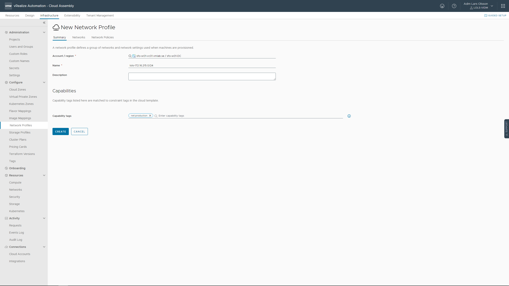
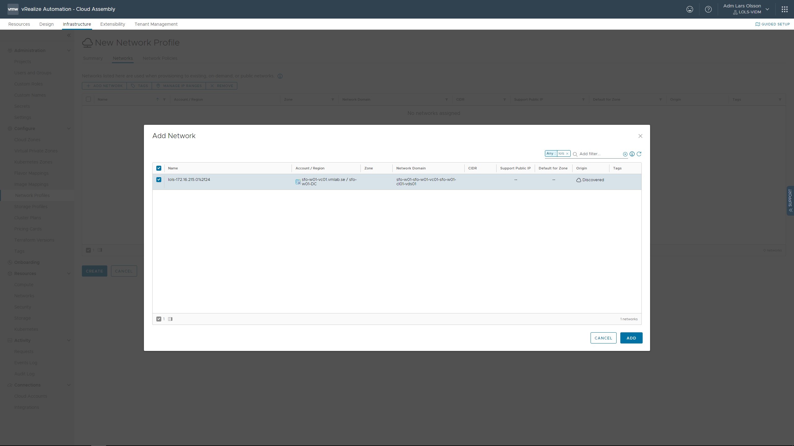
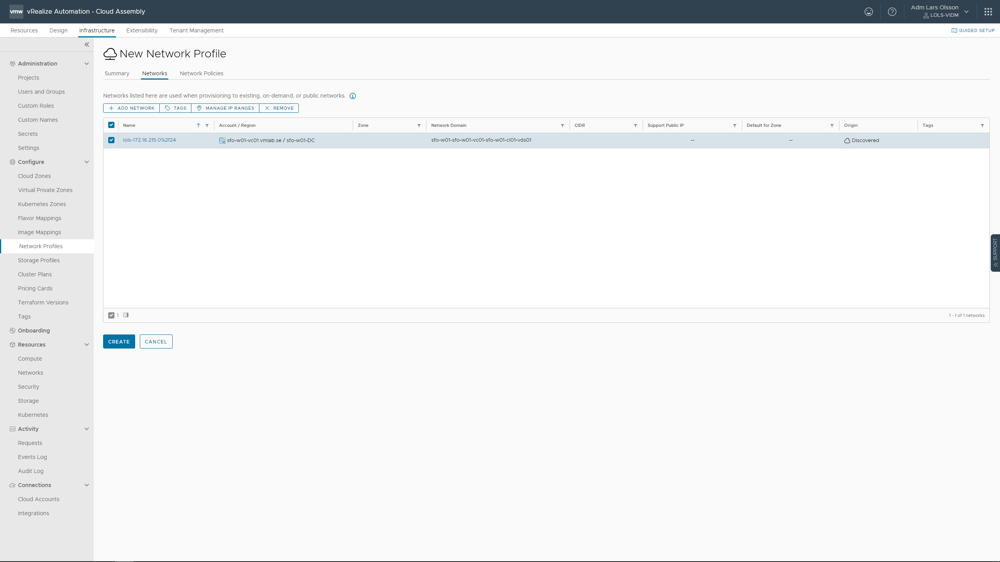
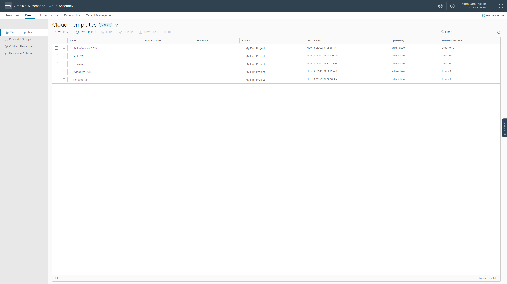
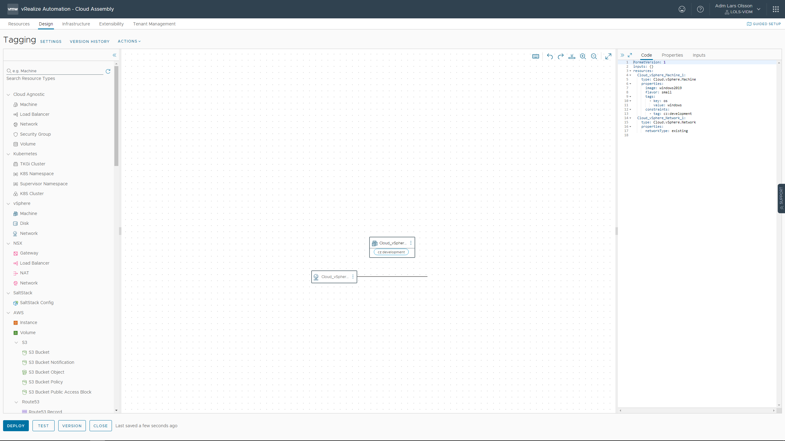

Cloud Assembly - Infrastructure - Network Profiles - NEW NETWORK PROFILE


Give your network profile a name and a capability tag. In this example I'm using 'net:production'



Go to Networks tab. Click ADD NETWORK. Select the network you want to provision to. This can be the same network as you enabled as the Default for Zone [during the initial setup](/aria-automation/initial-setup.md). Click ADD.



Click CREATE.



Go to the Design tab. Click the Tagging Cloud Template to modify it.



Start off by dragging a vSphere Network out on to the canvas.



Modify the YAML code to include the following. This should belong to the vSphere.Machine properties object. 

```
networks:
  - network: ${resource.Cloud_vSphere_Network_1.id}
```

And then add the following to the vSphere.Network properties object.

```
constraints: 
  - tag: net:production
```

The end result should look something like this.

```
formatVersion: 1
inputs: {}
resources:
  Cloud_vSphere_Machine_1:
    type: Cloud.vSphere.Machine
    properties:
      networks:
        - network: ${resource.Cloud_vSphere_Network_1.id}
      image: windows2019
      flavor: small
      tags:
        - key: os
          value: windows
      constraints:
        - tag: cz:development

  Cloud_vSphere_Network_1:
    type: Cloud.vSphere.Network
    properties:
      networkType: existing
      constraints: 
        - tag: net:production
```

This will make sure your VM end up in the Network profile that is tagged with 'net:production'

Go ahead and deploy to try it out.

[Done.](https://larols.github.io/vmware-aria/)
