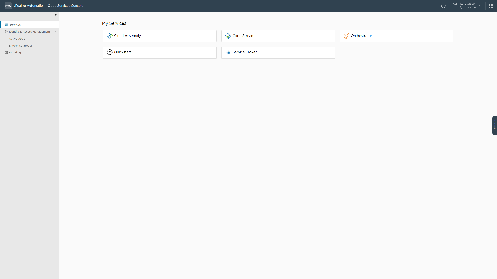
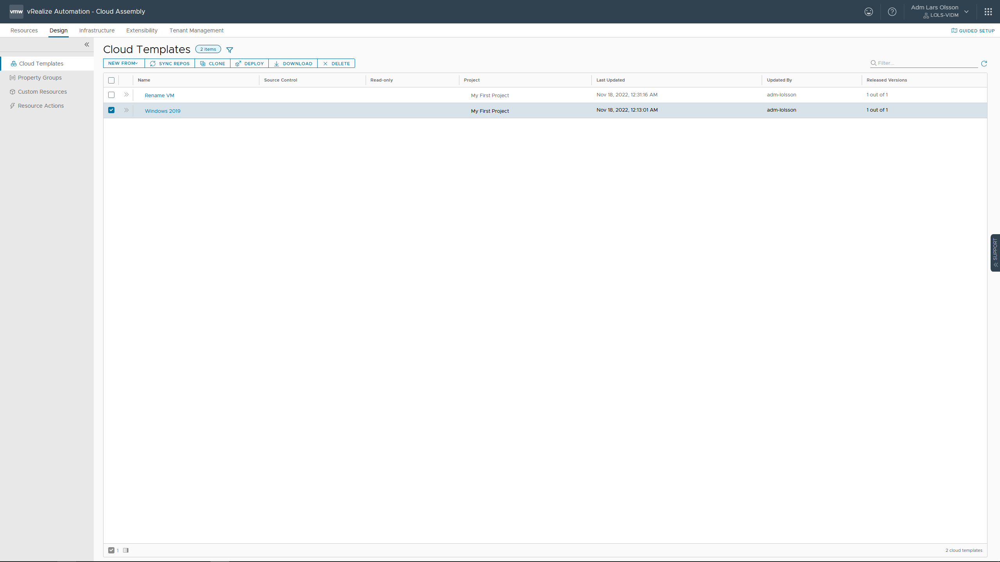
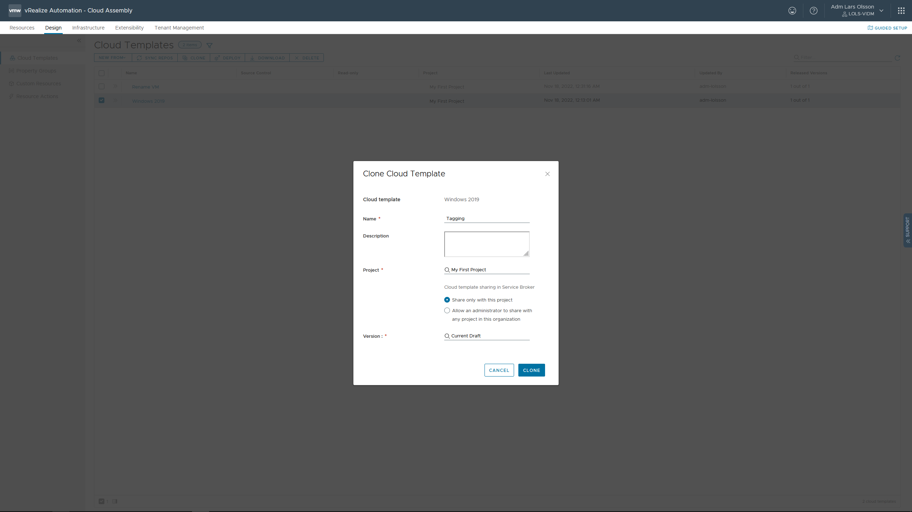
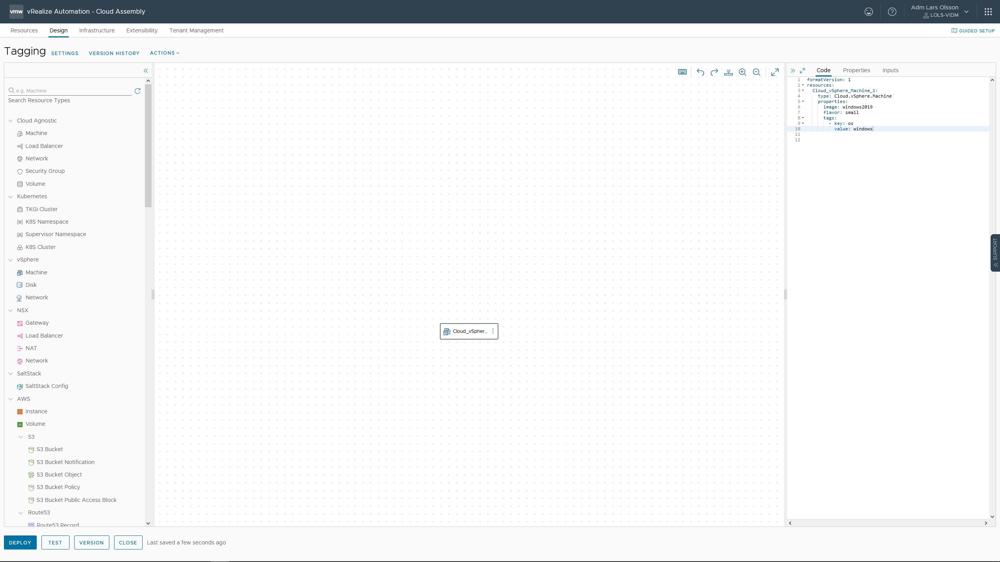
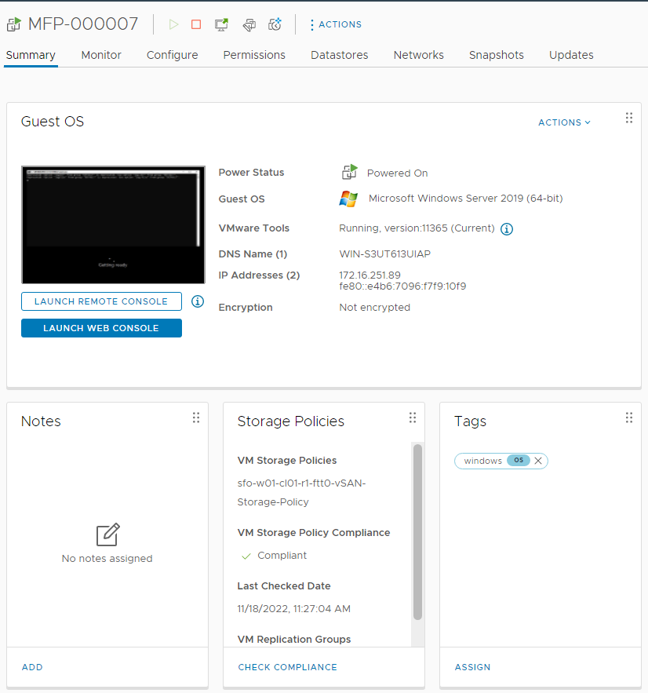
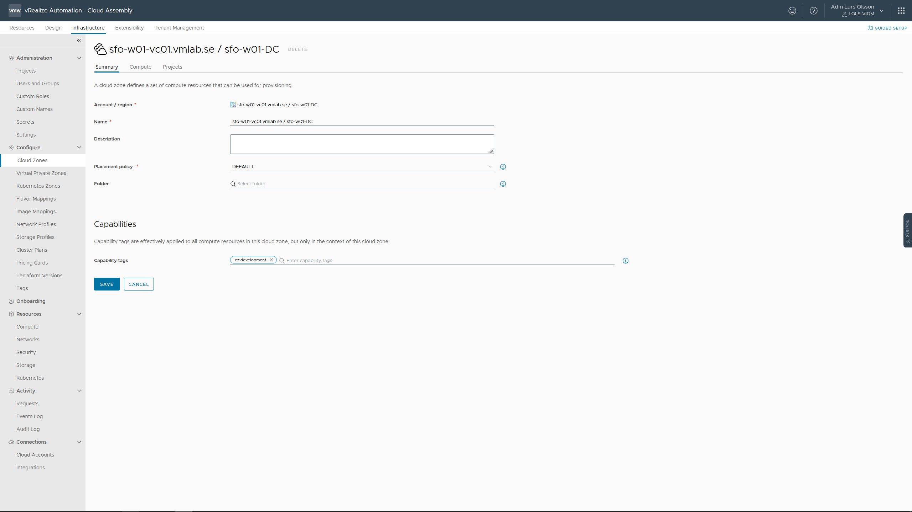
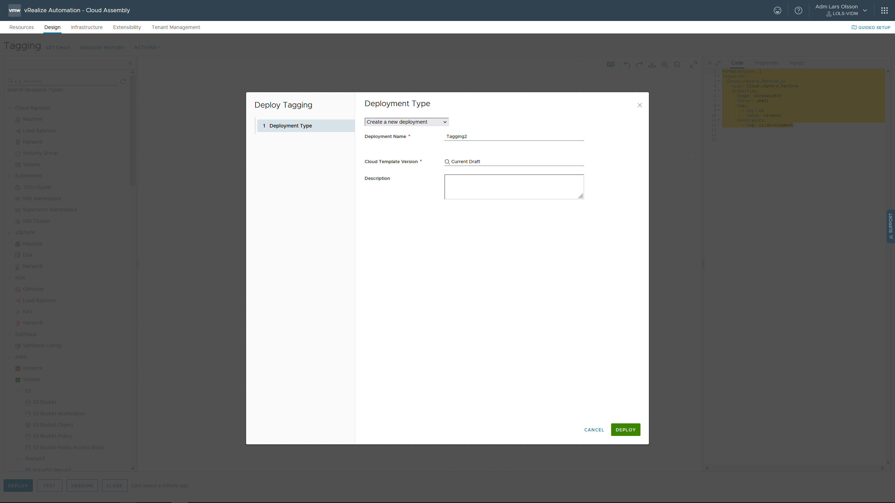
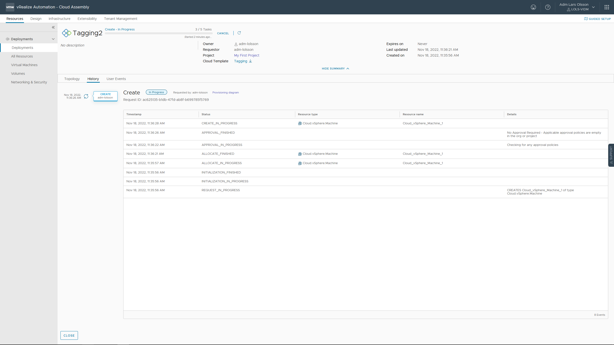
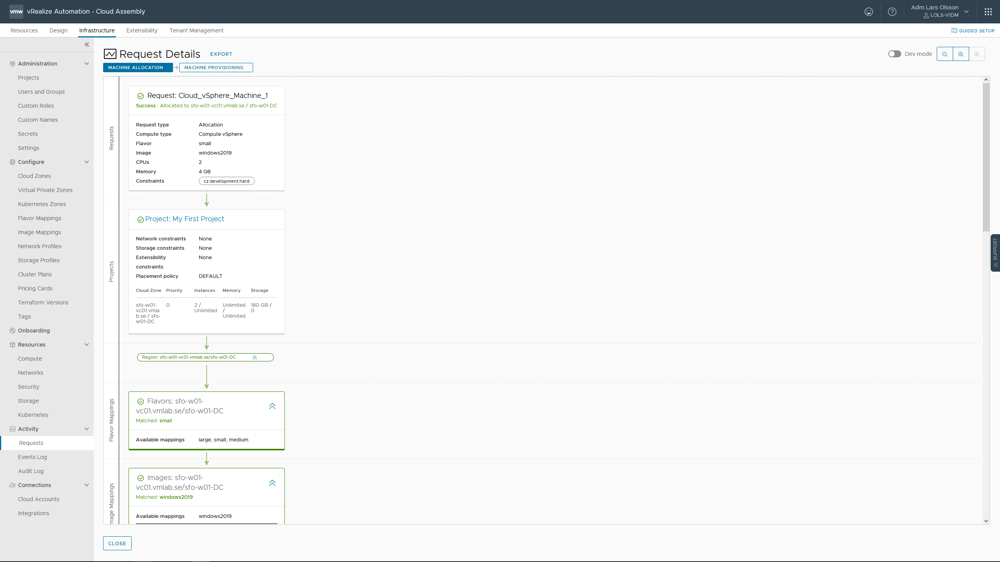

Tags are powerful metadata that you can associate with resources and include in templates. You can use tags in a variety of management scenarios, including workload placement and resource labeling.









Modify the YAML Code to look like this. We are adding the three last lines of code.

```
formatVersion: 1
resources:
  Cloud_vSphere_Machine_1:
    type: Cloud.vSphere.Machine
    properties:
      image: windows2019
      flavor: small
      tags: 
        - key: os
          value: windows
```


Hit DEPLOY. Give your Deployment a name and deploy your template. Notice your new VM will show your tag in vCenter Server.




------

Go to Infrastructure - Cloud Zones. Open the Cloud Zone to add a tag. In my example I will add the tag 'cz:development' in the Capabilities field. Click SAVE.



Go back to Design and open the Tagging Cloud Template to modify it.


Modify the YAML Code to look like this. We are adding the three last lines of code. The constraints will make sure your VM is deployed to the Cloud Zone that carries the tag cz:development.

```
formatVersion: 1
resources:
  Cloud_vSphere_Machine_1:
    type: Cloud.vSphere.Machine
    properties:
      image: windows2019
      flavor: small
      tags: 
        - key: os
          value: windows
      constraints: 
        - tag: cz:development
```

Click DEPLOY. Give it a name and again click DEPLOY.



Click on Provisioning diagram to see details.





I recommend reading this about tags: https://docs.vmware.com/en/vRealize-Automation/8.10/Using-and-Managing-Cloud-Assembly/GUID-2F1E458B-06B1-43F5-A730-714987CB9332.html