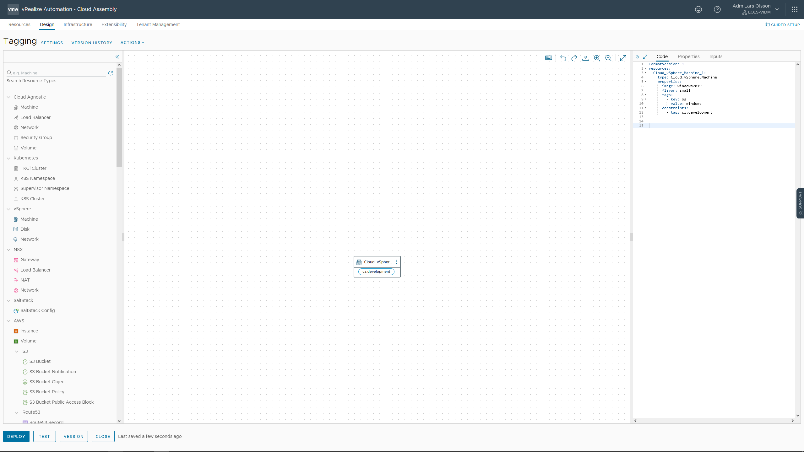

Tags are powerful metadata that you can associate with resources and include in templates. You can use tags in a variety of management scenarios, including workload placement and resource labeling.


```
formatVersion: 1
resources:
  Cloud_vSphere_Machine_1:
    type: Cloud.vSphere.Machine
    properties:
      image: windows2019
      flavor: small
      tags: 
        - key: os
          value: windows
```


Hit DEPLOY. Give your Deployment a name and deploy your template.


------


```
formatVersion: 1
resources:
  Cloud_vSphere_Machine_1:
    type: Cloud.vSphere.Machine
    properties:
      image: windows2019
      flavor: small
      tags: 
        - key: os
          value: windows
      constraints: 
        - tag: cz:development
```




Click on Provisioning diagram to see details.


I recommend reading this about tags: https://docs.vmware.com/en/vRealize-Automation/8.10/Using-and-Managing-Cloud-Assembly/GUID-2F1E458B-06B1-43F5-A730-714987CB9332.html